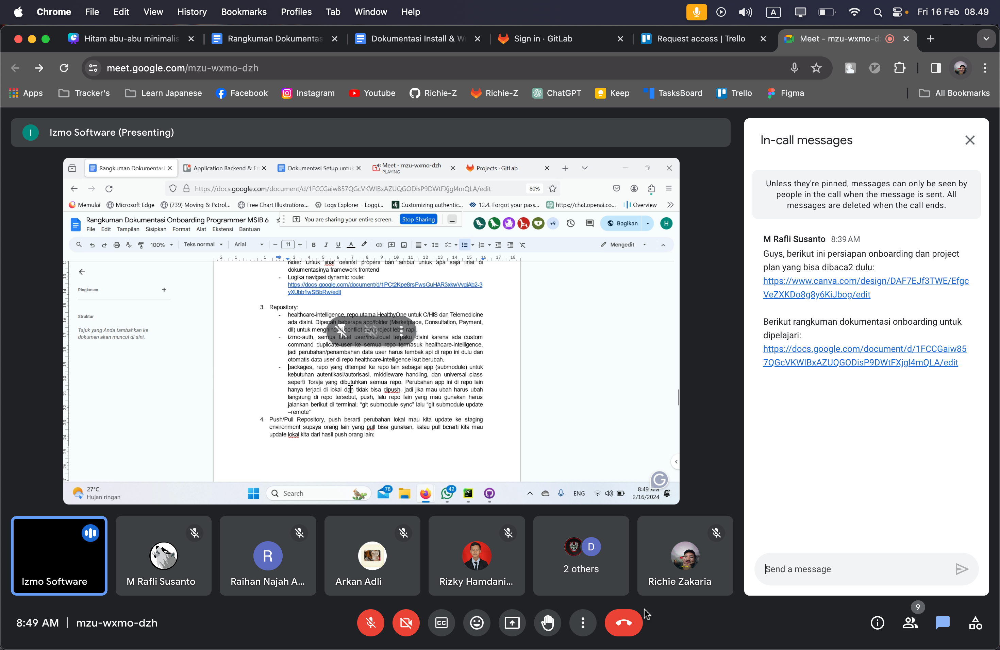
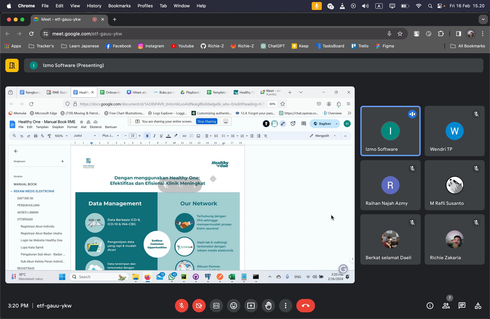
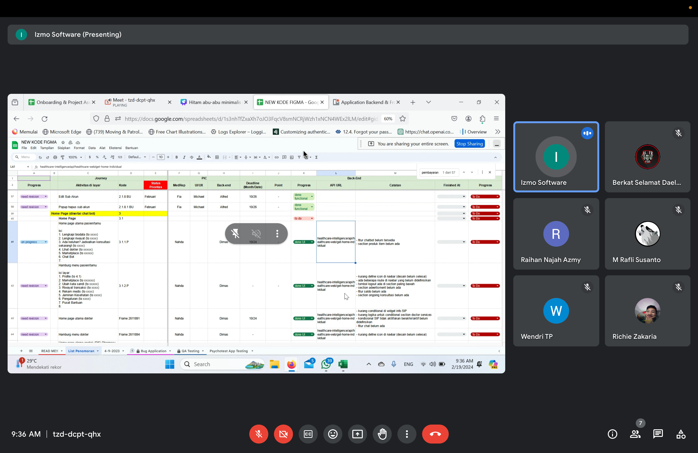
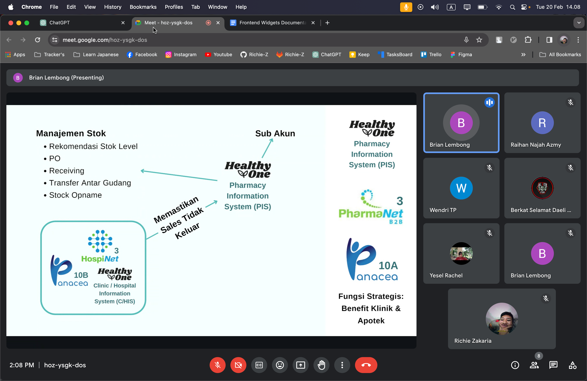
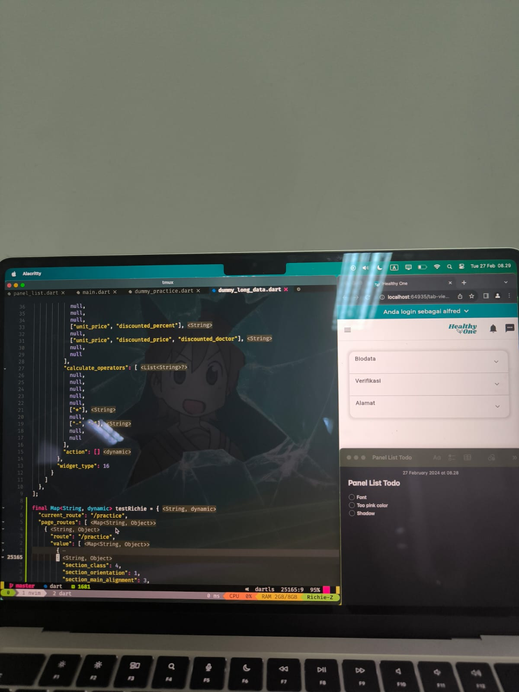
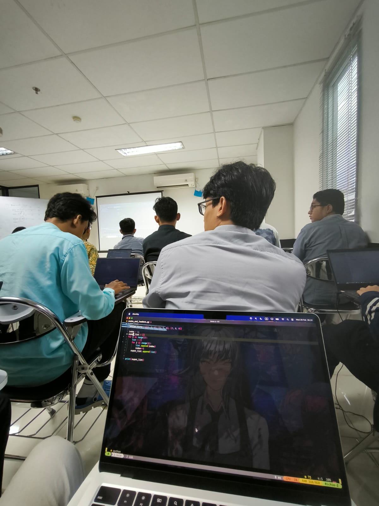

# February 2024 - Internship daily progress
Name        : Immanuel Richie De Harjo Zakaria  
Position    : Front-End Developer (Flutter)  
Month       : February 2024  
Start Date  : 16 Feb 24  
End Date    : 29 Feb 24  

  

## 16 Feb 24
-   Flutter Setup
    -   Cloning repo,buat akun gitlab

-   IT Project Management
    -   Membahas dokument rangkuman, projectnya tentang apa, dll.

## 19 Feb 24
Membahas it project management secara lanjut
Main project saya Frontend saja
-   Device Responsive
-   Fix bug

 
## 20 Feb 24
Membahas C/HIS dan Telemedicine lebih lanjut melalui online

## 26 Feb 24
Otw ke Jakarta

  
## 27 Feb 24
-   Styling panel list, yang di-style adalah font family, bg color, shadow.
-   Menambah key baru di struktur json dummy(key desktop)
-   Membuat logika di section parser saat mode desktop dan ada key desktop

## 28 Feb 24
Python Basic Programming

-   Membuat snake & Ladder
-   List Comprehension
-   Iterable:
	-   List []
	-   Tuple ()
	-   Set {}
	-   Dict {key:value}
	-   Range
-   While
	-   For => iterable
	-   While => boolean
	 
Python Server Driven UI

-   Django ORM
-   Display buat nampilin ke table admin
-   Editable blank null
-   Key fields bukan primary sama kek unique together memperbudah update, ket fields buat db
-   1 Record 1 Object
-   Bulk sync lihat key fields yang sama
-   Annotate buat field baru, outer ref sub query