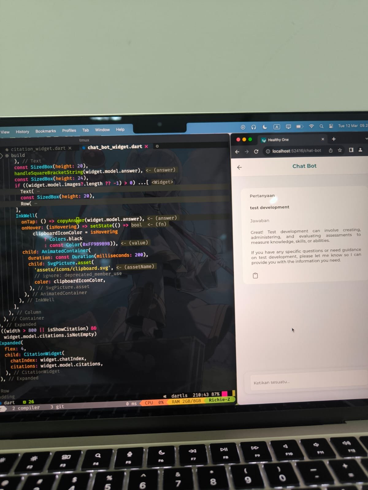

# March 2024 - Internship daily progress
Name 		: Immanuel Richie De Harjo Zakaria 
Position	: Front-End Developer (Flutter) 
Month 		: March 2024 
Start Date	: 1 Mar 24 
End Date	: 29 Mar 24 

## 1 Mar 24
1. Membuat widget baru yang bernama MapPreview (menggunakan flutter_maps)
2. Membuat dokumentasi frontend widget baru

3. Training flutter
    - Yg dipake itu flutter web
    - Widget == component
    - WidgetTree == widgets
4. Training SDUI/Backend Driven UI 
    - Dynamic routing -> backend yang harus diload awal fe cuma render api
    - Onclick route api redirect, on click route render Suda diload di away , extra content hamper sama kek on click dia tidek ubah slash awal 

## 4 Mar 24
1. Membuat key baru border_type pada section_extra.
ada 2 border_type:
    - 1 => Mirip seperti section_class 2
    - 2 => Tambah Card dan kasih shadow
2. Membuat logika agar bisa membaca border_type baru pada section_parsers
3. fix conflict di branch development 
4. Menemukan bug di search chip juga not required dan item yang sudah di pilih dihapus akan trigger shouldError

## 5 Mar 24
1. Membuat key baru untuk color_type di section_extra. berfungsi untuk mengubah warna sesuai dengan border_typenya.
2. Mencari bug di section parser saat ada media query selalu ke rebuild (contextnya global jadi keubah dikit pasti re-build)
3. Menganti cara agar tidak ambil width pake MediaQuery biar ga ke rebuild (menggunakaan responsive builder package)
4. Membuat Dokumentasi untuk border_type dan color_type pada section_extra baru

## 6 Mar 24
1. Layouting untuk Chat Bot page
2. Membuat widget utama untuk Chat Bot Page

## 7 Mar 24
1. Styling Chat Bot page
2. Menyelesasikan page Chat Bot (tunggu backend selesai buat API baru befungsi full)

## 8 Mar 24
1. Membuat function untuk memanipulasi string yang memiliki sitasi ([1]) agar penanda sitasinya memiliki style yang berbeda
2. Memperbaiki bug duplicate image di chat_bot
3. Mengintegrasi Chat Bot yang kubuat dengan anak anak backend dan AI

## 12 Mar 24
1. Membuat tombol copy di chatbot
2. Menambah disclaimer di chatbot
3. Membetulkan bug jika response bot ada imagesnya (masalah tipe data)
4. Membuat fitur baru untuk time_field yaitu fitur deactivatable based on switch button
